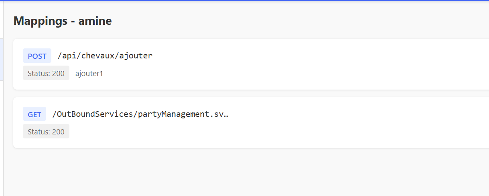
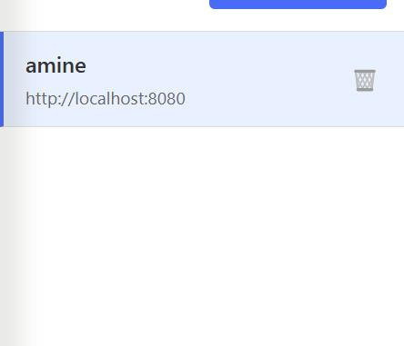
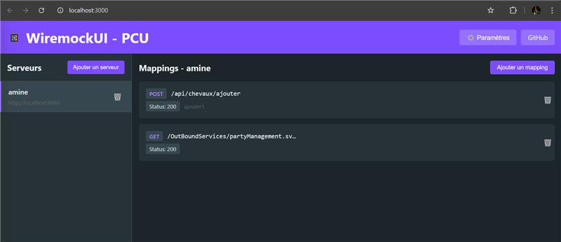
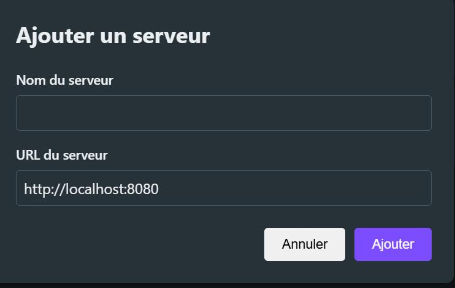
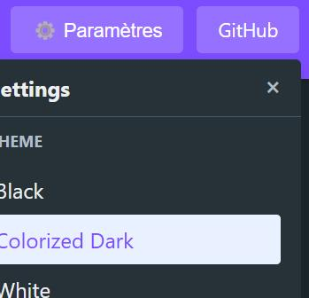
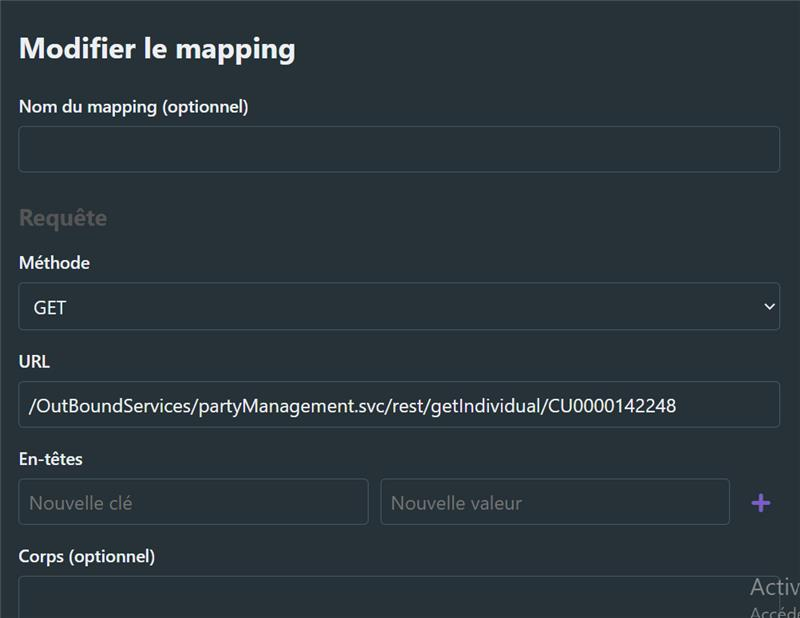

# WiremockUI - PCU

Une interface utilisateur pour gérer des serveurs Wiremock avec persistance des configurations, développée dans le cadre d'un stage sur la Prise de Commande Unifiée (PCU).

## Fonctionnalités

- Gestion des serveurs Wiremock
- Création et modification de mappings
- Persistance des configurations après redémarrage
- Interface utilisateur moderne avec thèmes

## Captures d'écran

### Liste des mappings

### Liste des serveurs

### Page d'accueil

### Ajout d'un mapping

### Ajout d'un serveur

### Les différents thème

### Modification d'un mapping

